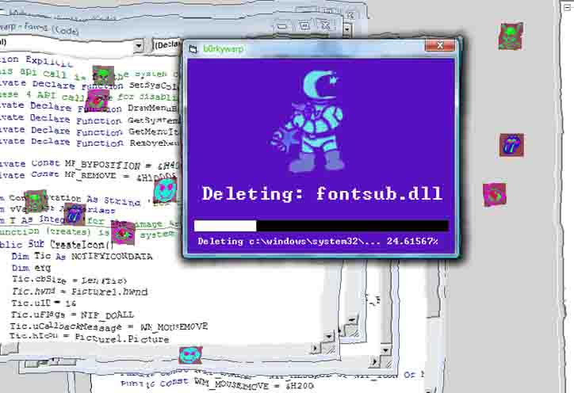



## b0rkywarp

### Description

Warp your computer with b0rkywarp, EXE 96KB!!! This app will list your system dir and randomly change color as icons scroll and melt the screen. Tons of feature's, Twip scalemode in Pixel, Z0rder, parsing array, image array, random RGB Progress Bar! After 100% is reached, it loops! Cool fatures using the hwnd property to make a form stay Ontop, create/delete a system tray icon, and disable the (x) button. ALso Disable ALT+F4 featur using the KeyDown function. Use Array's with z0rder, parsing array for file creation, image array create an animated GIF. Random RGB Color Progress Bar, Flaming Lables, Fake System Delete, melting effect, set and restore the system colors, it's all here folks, and under 100K\b!!!
 
### More Info
 
"Dirs.txt" For Input As #1

I would love any feedback, esspecially to the system colors error in the public declare statement.

Kill App.Path & "Dirs.txt"

it wracks up a large chunk of the CPU... I'm having a conflict with the flaming label and the ammount of text that it can hold. the prjmain Form, loops when the system colors are set. because of the Private Declare Function.

             |
---                |---
**Submitted On**   |2009-10-18 16:04:58
**By**             |[Oddacon T\. Ripper](https://github.com/Planet-Source-Code/PSCIndex/blob/master/ByAuthor/oddacon-t-ripper.md)
**Level**          |Advanced
**User Rating**    |5.0 (25 globes from 5 users)
**Compatibility**  |VB 6\.0
**Category**       |[Jokes/ Humor](https://github.com/Planet-Source-Code/PSCIndex/blob/master/ByCategory/jokes-humor__1-40.md)
**World**          |[Visual Basic](https://github.com/Planet-Source-Code/PSCIndex/blob/master/ByWorld/visual-basic.md)
**Archive File**   |[b0rkywarp21654410182009\.zip](https://github.com/Planet-Source-Code/oddacon-t-ripper-b0rkywarp__1-72561/archive/master.zip)

### API Declarations

Private Declare Function SetSysColors Lib "user32" (ByVal nChanges As Long, lpSysColor As Long, lpColorValues As Long) As Long 
 
Private Declare Function DrawMenuBar Lib "user32" (ByVal hwnd As Long) As Long 
Private Declare Function GetSystemMenu Lib "user32" (ByVal hwnd As Long, ByVal bRevert As Long) As Long 
Private Declare Function GetMenuItemCount Lib "user32" (ByVal hMenu As Long) As Long 
Private Declare Function RemoveMenu Lib "user32" (ByVal hMenu As Long, ByVal nPosition As Long, ByVal wFlags As Long) As Long

